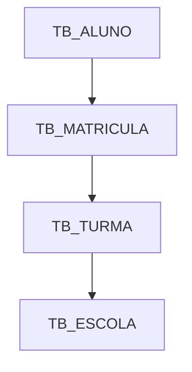

# db_map — Mapa do Banco de Dados para IA

Documentação pré-gerada do schema SQL Server para consumo pela IA, evitando exploração em tempo real via MCP (cara em tokens e inconsistente).

## Por que existe

O MCP `sqlserver` permite que a IA explore o schema em tempo real, mas isso:
- Consome muitos tokens por query de introspecção
- Gera resultados inconsistentes entre conversas
- Não captura semântica (o que uma tabela *significa* no domínio)

O pipeline ideal é:

```
Banco (ElevaPortalHomolog)
  → _scripts/db_map/extractor.py
  → _pde/db_map/
  → IA consome contexto pronto
```

## Estrutura de arquivos

```
_pde/db_map/
  readme.md           # este arquivo
  changelog.md        # data da última extração por script
  schema/
    tables.yaml       # tabelas, PKs, colunas importantes, relações
    relations.yaml    # FKs explícitas
    joins.yaml        # caminhos de join prontos (ouro para a IA)
  domains/
    academico.md      # Aluno, Turma, Escola, Série, AnoLetivo
    frequencia.md     # Aula, EventoFrequencia, FrequenciaAluno
    avaliacao.md      # Notas, Avaliações
    acesso.md         # Pessoa, PessoaEscola, PessoaEscolaAcesso
  diagrams/
    erd.mmd           # Grafo Mermaid do schema completo
    erd-frequencia.mmd
    erd-avaliacao.mmd
```

## Scripts

Ficam em `_scripts/db_map/`. Rodar manualmente quando o schema mudar.

| Script | Responsabilidade |
|--------|-----------------|
| `extractor.py` | Conecta no SQL Server, extrai tabelas/PKs/FKs/índices/views |
| `generate_schema_yaml.py` | Gera `schema/tables.yaml` e `schema/relations.yaml` |
| `generate_joins.py` | Detecta caminhos de join e gera `schema/joins.yaml` |
| `generate_mermaid.py` | Gera grafos `.mmd` por domínio |
| `generate_domains.py` | Agrupa tabelas por domínio e gera os `.md` |
| `run_all.py` | Executa todos os scripts em sequência e atualiza `changelog.md` |

Dependências: `pyodbc`, `pyyaml`.

## Formato dos outputs

### `schema/tables.yaml`

```yaml
tables:
  TB_ALUNO:
    pk: ID_ALUNO
    description: Cadastro principal do aluno
    importantColumns:
      - NM_ALUNO
      - CD_SITUACAO
    relations:
      - to: TB_MATRICULA
        type: 1:N
        via: ID_ALUNO
```

### `schema/joins.yaml`

```yaml
joinPaths:
  aluno_turma:
    description: Caminho de aluno até turma via matrícula
    path:
      - TB_ALUNO.ID_ALUNO
      - TB_MATRICULA.ID_ALUNO
      - TB_MATRICULA.ID_TURMA
      - TB_TURMA.ID_TURMA
```

### `domains/frequencia.md`

```markdown
# Frequência

## Conceitos principais
- Aula: registro de uma aula realizada em uma turma
- EventoFrequencia: evento de chamada associado a uma aula
- FrequenciaAluno: resposta de presença por aluno

## Fluxo
Turma → Aula → EventoFrequencia → FrequenciaAluno

## Tabelas envolvidas
- TB_AULA
- TB_EVENTO_FREQUENCIA
- TB_FREQUENCIA_ALUNO
```

### `diagrams/erd.mmd`



## Como a IA deve usar este mapa

1. **Antes de usar o MCP sqlserver**, verificar `changelog.md` — se a extração for recente (< 30 dias), carregar os arquivos relevantes do `db_map` em vez de explorar o schema ao vivo.
2. Para queries simples em um domínio: carregar só o `domains/<dominio>.md` + `schema/joins.yaml`.
3. Para queries cross-domínio: carregar `schema/tables.yaml` + `schema/relations.yaml`.
4. Usar MCP apenas para dados que não estão no mapa (ex: contagem de registros, valores de exemplo).

## Curiosidades do schema ElevaPortalHomolog

> Estas observações complementam o que o extractor automático não captura.

- **`AlunoEscola.AlunoEscola_key`** é FK para `PessoaEscolaAcesso.Id`, **não** para `Pessoa.Id`.  
  Para obter o hash do aluno: `AlunoEscola_key → PessoaEscolaAcesso.Id → PessoaEscolaAcesso.PessoaEscola → PessoaEscola.Pessoa → Pessoa.Hash`
- **`AnoLetivo.Id`** = o próprio ano (ex: `2026`). `Vigente = 1` indica o ano corrente.  
  `AlunoEscola.AnoLetivo` armazena esse valor numérico diretamente.
- Tabelas sem sufixo `Id` nas FKs: `Turma.EscolaSerie`, `EscolaSerie.Escola`, `Escola.Rede`, `EscolaSerie.Serie`, `EscolaSerie.AnoLetivo` — são IDs diretos.

## Manutenção

Rodar `run_all.py` sempre que:
- Houver migration no banco
- Um novo domínio surgir no sistema
- A IA começar a errar joins com frequência (sinal de schema desatualizado)
